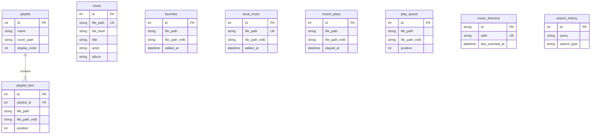

# 数据库架构文档

本文档描述了 XM Music 应用程序的 SQLite 数据库架构。

## 概述

数据库设计采用混合模式：
1. **核心元数据**：`music` 表存储所有已扫描音乐文件的核心元数据。
2. **独立列表**：v1.0.5 版本引入了“列表独立性”架构，`local_music`, `favorites`, `playlist_item`, `recent_plays` 等表独立存储文件路径和 MD5，不再强依赖 `music` 表的 ID。这提高了系统的健壮性，即使 `music` 表重修构建，也不会丢失用户列表。

## 表关系图 (ER Diagram)

## 表定义详情

### 1. 核心音乐表 (`music`)
存储所有扫描到的音乐文件的详细元数据。

| 字段 | 类型 | 描述 | 备注 |
| :--- | :--- | :--- | :--- |
| `id` | INTEGER | 主键 | 自增 |
| `title` | TEXT | 标题 | NOT NULL |
| `artist` | TEXT | 艺术家 | NOT NULL |
| `album` | TEXT | 专辑 | |
| `year` | INTEGER | 年份 | |
| `genre` | TEXT | 流派 | |
| `file_path` | TEXT | 文件路径 | **UNIQUE**, NOT NULL |
| `file_name` | TEXT | 文件名 | NOT NULL |
| `file_size` | INTEGER | 文件大小 | NOT NULL |
| `file_hash` | TEXT | 文件哈希 | NOT NULL, 索引 |
| `file_extension` | TEXT | 扩展名 | NOT NULL |
| `duration` | INTEGER | 时长(秒) | |
| `bitrate` | INTEGER | 比特率 | |
| `sample_rate` | INTEGER | 采样率 | |
| `channels` | INTEGER | 声道数 | |
| `cover_path` | TEXT | 封面路径 | |
| `lyrics_path` | TEXT | 歌词路径 | |
| `play_count` | INTEGER | 播放次数 | 默认 0 |
| `last_played_at` | DATETIME | 上次播放时间 | |
| `favorite` | INTEGER | (旧)是否收藏 | 默认 0, 已由 `favorites` 表接管 |
| `added_at` | DATETIME | 添加时间 | 默认 CURRENT_TIMESTAMP |
| `updated_at` | DATETIME | 更新时间 | 默认 CURRENT_TIMESTAMP |
| `is_corrupted` | INTEGER | 是否损坏 | 默认 0 |
| `is_duplicate` | INTEGER | 是否重复 | 默认 0 |

### 2. 播放列表 (`playlist`)
用户创建的歌单。

| 字段 | 类型 | 描述 | 备注 |
| :--- | :--- | :--- | :--- |
| `id` | INTEGER | 主键 | 自增 |
| `name` | TEXT | 歌单名称 | NOT NULL |
| `description` | TEXT | 描述 | |
| `cover_path` | TEXT | 封面路径 | |
| `display_order` | INTEGER | 显示顺序 | 默认 0 |
| `song_count` | INTEGER | 歌曲数量 | 默认 0 |
| `total_duration` | INTEGER | 总时长 | 默认 0 |
| `created_at` | DATETIME | 创建时间 | |
| `updated_at` | DATETIME | 更新时间 | |

### 3. 播放列表项 (`playlist_item`)
歌单中的歌曲项。独立存储文件路径。

| 字段 | 类型 | 描述 | 备注 |
| :--- | :--- | :--- | :--- |
| `id` | INTEGER | 主键 | 自增 |
| `playlist_id` | INTEGER | 归属歌单ID | 外键 -> `playlist.id` |
| `file_path` | TEXT | 文件路径 | NOT NULL |
| `file_path_md5` | TEXT | 路径MD5 | 用于快速查找索引 |
| `position` | INTEGER | 排序位置 | NOT NULL |
| `added_at` | DATETIME | 添加时间 | |

### 4. 收藏 (`favorites`)
用户收藏的歌曲列表。

| 字段 | 类型 | 描述 | 备注 |
| :--- | :--- | :--- | :--- |
| `id` | INTEGER | 主键 | 自增 |
| `file_path` | TEXT | 文件路径 | UNIQUE, NOT NULL |
| `file_path_md5` | TEXT | 路径MD5 | 索引 |
| `added_at` | DATETIME | 添加时间 | |

### 5. 本地音乐列表 (`local_music`)
本地库中的所有音乐文件列表。

| 字段 | 类型 | 描述 | 备注 |
| :--- | :--- | :--- | :--- |
| `id` | INTEGER | 主键 | 自增 |
| `file_path` | TEXT | 文件路径 | UNIQUE, NOT NULL |
| `file_path_md5` | TEXT | 路径MD5 | 索引 |
| `added_at` | DATETIME | 添加时间 | |

### 6. 最近播放 (`recent_plays`)
最近播放的历史记录。

| 字段 | 类型 | 描述 | 备注 |
| :--- | :--- | :--- | :--- |
| `id` | INTEGER | 主键 | 自增 |
| `file_path` | TEXT | 文件路径 | NOT NULL |
| `file_path_md5` | TEXT | 路径MD5 | 索引 |
| `played_at` | DATETIME | 播放时间 | |

### 7. 播放队列 (`play_queue`)
当前的播放队列。

| 字段 | 类型 | 描述 | 备注 |
| :--- | :--- | :--- | :--- |
| `id` | INTEGER | 主键 | 自增 |
| `file_path` | TEXT | 文件路径 | NOT NULL |
| `file_path_md5` | TEXT | 路径MD5 | 索引 |
| `position` | INTEGER | 队列位置 | |
| `added_at` | DATETIME | 添加时间 | |

### 8. 音乐目录 (`music_directory`)
配置的扫描目录。

| 字段 | 类型 | 描述 | 备注 |
| :--- | :--- | :--- | :--- |
| `id` | TEXT | 主键 | UUID |
| `path` | TEXT | 目录路径 | UNIQUE, NOT NULL |
| `scan_depth` | TEXT | 扫描深度 | 'recursive' |
| `last_scanned_at` | DATETIME | 上次扫描时间 | |

### 9. 搜索历史 (`search_history`)

| 字段 | 类型 | 描述 | 备注 |
| :--- | :--- | :--- | :--- |
| `id` | INTEGER | 主键 | 自增 |
| `query` | TEXT | 搜索词 | NOT NULL |
| `search_type` | TEXT | 类型 | 'basic' / 'advanced' |
| `created_at` | DATETIME | 搜索时间 | |

### 10. 设置 (`settings`)
Key-Value 形式的应用设置。

| 字段 | 类型 | 描述 | 备注 |
| :--- | :--- | :--- | :--- |
| `key` | TEXT | 配置键 | PK |
| `value` | TEXT | 配置值 | |

### 11. 全文搜索 (`music_fts`)
使用 SQLite FTS5 引擎的虚拟表，用于快速搜索。
- 包含字段: `title`, `artist`, `album`, `genre`
- 由 Trigger 自动维护 (`music_fts_insert`, `music_fts_update`, `music_fts_delete`)
