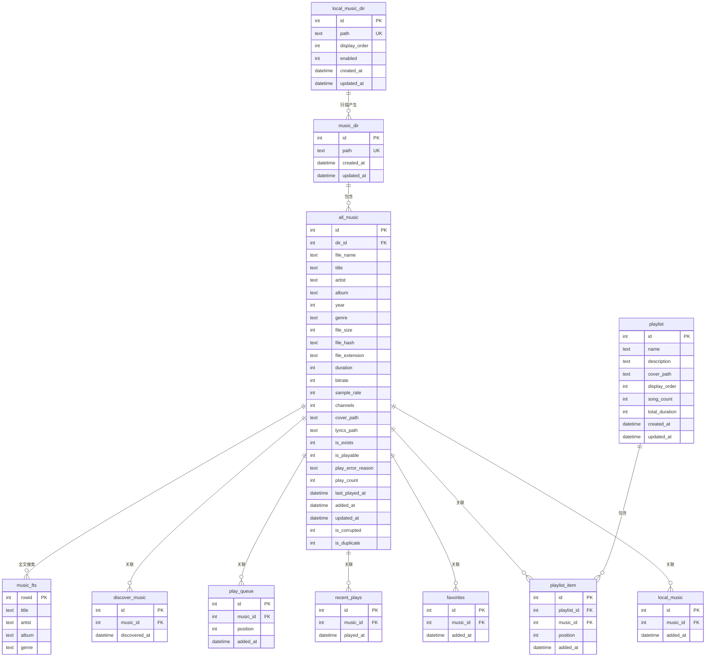

# XMMusic v1.0.6 数据库架构设计文档

**设计日期**: 2025-12-10
**架构师**: Winston
**版本**: v1.0.6
**数据库**: SQLite 3

---

## 一、设计概述

### 1.1 设计目标

1. **存储优化**：通过目录表（`music_dir`）减少重复路径存储，提升存储效率
2. **查询性能**：统一使用整数ID关联，替代字符串路径匹配，提升查询性能
3. **数据一致性**：通过外键约束保证数据完整性
4. **跨平台兼容**：统一路径规范化处理，支持 Windows/macOS/Linux

### 1.2 核心设计原则

- **数据驱动设计**：以数据访问模式驱动表结构设计
- **性能优先**：关键查询路径必须建立索引
- **数据完整性**：使用外键约束和唯一性约束保证数据一致性
- **可扩展性**：设计考虑未来扩展需求
- **简化实现**：避免过度设计，保持结构清晰

### 1.3 架构变更

| 变更项 | v1.0.5 | v1.0.6 |
|--------|--------|--------|
| 数据库名称 | `xm.db` / `xm-dev.db` | `m.db` / `m-dev.db` |
| 核心音乐表 | `music` | `all_music` |
| 路径存储 | 完整路径字符串 | `dir_id` + `file_name` |
| 列表关联 | `file_path` 字符串匹配 | `music_id` 整数关联 |
| 目录管理 | `music_directory`（无限制） | `local_music_dir`（最多20个）+ `music_dir`（所有目录） |

---

## 二、数据库架构设计

### 2.1 实体关系图 (ER Diagram)



### 2.2 表结构详细设计

#### 2.2.1 `local_music_dir` 表（扫描根目录配置表）

**用途**：存储用户配置的自动扫描根目录列表（最多20个）

**表结构**：
```sql
CREATE TABLE IF NOT EXISTS local_music_dir (
  id INTEGER PRIMARY KEY AUTOINCREMENT,
  path TEXT UNIQUE NOT NULL,              -- 扫描根目录完整路径（规范化后）
  display_order INTEGER DEFAULT 0,        -- 显示顺序
  enabled INTEGER DEFAULT 1,              -- 是否启用扫描（1=启用，0=禁用）
  created_at DATETIME DEFAULT CURRENT_TIMESTAMP,
  updated_at DATETIME DEFAULT CURRENT_TIMESTAMP
);
```

**索引**：
```sql
CREATE INDEX IF NOT EXISTS idx_local_music_dir_order ON local_music_dir(display_order);
CREATE INDEX IF NOT EXISTS idx_local_music_dir_enabled ON local_music_dir(enabled);
CREATE INDEX IF NOT EXISTS idx_local_music_dir_path ON local_music_dir(path);
```

**约束**：
- `path` 唯一性约束：防止重复添加相同目录
- 应用层限制：最多20条记录

**设计说明**：
- 不关联 `music_dir` 表，直接存储路径
- `enabled` 字段允许临时禁用某个扫描目录
- `display_order` 用于UI显示排序
- 路径在存储前进行规范化处理

**管理功能**：
- **添加目录**：验证路径有效性、检查数量限制、自动分配显示顺序
- **删除目录**：可选择同时删除已扫描的文件
- **更新目录**：支持更新路径、显示顺序、启用状态
- **查询目录**：支持按启用状态、显示顺序等条件查询
- **重新排序**：批量更新显示顺序

---

#### 2.2.2 `music_dir` 表（音乐目录表）

**用途**：存储 `all_music` 表中所有音乐文件所在的目录路径

**表结构**：
```sql
CREATE TABLE IF NOT EXISTS music_dir (
  id INTEGER PRIMARY KEY AUTOINCREMENT,
  path TEXT UNIQUE NOT NULL,              -- 目录完整路径（规范化后）
  created_at DATETIME DEFAULT CURRENT_TIMESTAMP,
  updated_at DATETIME DEFAULT CURRENT_TIMESTAMP
);
```

**索引**：
```sql
CREATE INDEX IF NOT EXISTS idx_music_dir_path ON music_dir(path);
```

**约束**：
- `path` 唯一性约束：同一目录只存储一次

**路径规范化规则**：
- Windows: `C:\Music\Rock` → `C:/Music/Rock`（统一使用正斜杠）
- macOS/Linux: `/Users/name/Music/Rock` → `/Users/name/Music/Rock`（保持不变）
- 去除末尾分隔符：`/path/to/dir/` → `/path/to/dir`
- 统一大小写：Windows 路径不区分大小写，但存储时保持原始大小写

**设计说明**：
- 扫描时自动填充，不需要手动管理
- 同一目录下的多个文件共享一个 `dir_id`，显著减少存储空间
- 路径规范化确保跨平台一致性

---

#### 2.2.3 `all_music` 表（核心音乐表）

**用途**：存储所有音乐文件的元数据和状态信息

**表结构**：
```sql
CREATE TABLE IF NOT EXISTS all_music (
  -- 主键和路径
  id INTEGER PRIMARY KEY AUTOINCREMENT,
  dir_id INTEGER NOT NULL,                -- 目录ID（外键 -> music_dir.id）
  file_name TEXT NOT NULL,                -- 文件名（不含路径）

  -- 元数据
  title TEXT NOT NULL,                    -- 标题
  artist TEXT NOT NULL,                   -- 艺术家
  album TEXT,                             -- 专辑
  year INTEGER,                           -- 年份
  genre TEXT,                             -- 流派

  -- 文件信息
  file_size INTEGER NOT NULL,              -- 文件大小（字节）
  file_hash TEXT NOT NULL,                 -- 文件哈希值（用于去重）
  file_extension TEXT NOT NULL,            -- 文件扩展名（如：mp3, flac）

  -- 音频属性
  duration INTEGER,                        -- 时长（秒）
  bitrate INTEGER,                         -- 比特率（kbps）
  sample_rate INTEGER,                     -- 采样率（Hz）
  channels INTEGER,                        -- 声道数（1=单声道，2=立体声）

  -- 关联资源路径
  cover_path TEXT,                         -- 封面路径（相对路径或完整路径）
  lyrics_path TEXT,                        -- 歌词路径（相对路径或完整路径）

  -- 状态字段
  is_exists INTEGER DEFAULT 1,           -- 文件是否存在（1=存在，0=不存在）
  is_playable INTEGER DEFAULT 1,          -- 是否可以播放（1=可播放，0=不可播放）
  play_error_reason TEXT,                  -- 不能播放的原因

  -- 播放统计
  play_count INTEGER DEFAULT 0,           -- 播放次数
  last_played_at DATETIME,                 -- 最后播放时间

  -- 时间戳
  added_at DATETIME DEFAULT CURRENT_TIMESTAMP,
  updated_at DATETIME DEFAULT CURRENT_TIMESTAMP,

  -- 标记字段
  is_corrupted INTEGER DEFAULT 0,         -- 是否损坏（1=损坏，0=正常）
  is_duplicate INTEGER DEFAULT 0,         -- 是否重复（1=重复，0=不重复）

  -- 外键约束
  FOREIGN KEY (dir_id) REFERENCES music_dir(id) ON DELETE RESTRICT,

  -- 唯一性约束：同一目录下文件名唯一
  UNIQUE(dir_id, file_name)
);
```

**索引**：
```sql
-- 目录关联索引
CREATE INDEX IF NOT EXISTS idx_all_music_dir_id ON all_music(dir_id);
CREATE INDEX IF NOT EXISTS idx_all_music_dir_file ON all_music(dir_id, file_name);

-- 状态索引
CREATE INDEX IF NOT EXISTS idx_all_music_exists ON all_music(is_exists);
CREATE INDEX IF NOT EXISTS idx_all_music_playable ON all_music(is_playable);
CREATE INDEX IF NOT EXISTS idx_all_music_corrupted ON all_music(is_corrupted);

-- 搜索索引
CREATE INDEX IF NOT EXISTS idx_all_music_artist_title ON all_music(artist, title);
CREATE INDEX IF NOT EXISTS idx_all_music_album ON all_music(album);
CREATE INDEX IF NOT EXISTS idx_all_music_genre ON all_music(genre);

-- 文件哈希索引（用于去重）
CREATE INDEX IF NOT EXISTS idx_all_music_file_hash ON all_music(file_hash);

-- 播放统计索引
CREATE INDEX IF NOT EXISTS idx_all_music_play_count ON all_music(play_count DESC);
CREATE INDEX IF NOT EXISTS idx_all_music_last_played ON all_music(last_played_at DESC);

-- 时间索引
CREATE INDEX IF NOT EXISTS idx_all_music_added_at ON all_music(added_at DESC);
```

**完整路径构建**：
```typescript
// 工具函数：构建完整文件路径
function buildFullPath(dirPath: string, fileName: string, platform: NodeJS.Platform): string {
  const separator = platform === 'win32' ? '\\' : '/'
  // 确保 dirPath 不以分隔符结尾
  const normalizedDir = dirPath.replace(/[/\\]+$/, '')
  return `${normalizedDir}${separator}${fileName}`
}
```

**设计说明**：
- `dir_id + file_name` 组合唯一性：同一目录下不能有同名文件
- `ON DELETE RESTRICT`：防止误删目录导致数据丢失
- `is_exists` 和 `is_playable` 字段支持文件状态追踪
- `play_error_reason` 存储播放失败的具体原因

---

#### 2.2.4 `local_music` 表（本地音乐列表）

**用途**：存储本地音乐库中的所有音乐文件

**表结构**：
```sql
CREATE TABLE IF NOT EXISTS local_music (
  id INTEGER PRIMARY KEY AUTOINCREMENT,
  music_id INTEGER NOT NULL UNIQUE,       -- 关联 all_music.id
  added_at DATETIME DEFAULT CURRENT_TIMESTAMP,

  FOREIGN KEY (music_id) REFERENCES all_music(id) ON DELETE CASCADE
);
```

**索引**：
```sql
CREATE INDEX IF NOT EXISTS idx_local_music_music_id ON local_music(music_id);
CREATE INDEX IF NOT EXISTS idx_local_music_added_at ON local_music(added_at DESC);
```

**设计说明**：
- `ON DELETE CASCADE`：删除音乐文件时自动从列表中移除
- `UNIQUE` 约束：防止重复添加同一首歌

---

#### 2.2.5 `favorites` 表（收藏列表）

**用途**：存储用户收藏的音乐

**表结构**：
```sql
CREATE TABLE IF NOT EXISTS favorites (
  id INTEGER PRIMARY KEY AUTOINCREMENT,
  music_id INTEGER NOT NULL UNIQUE,       -- 关联 all_music.id
  added_at DATETIME DEFAULT CURRENT_TIMESTAMP,

  FOREIGN KEY (music_id) REFERENCES all_music(id) ON DELETE CASCADE
);
```

**索引**：
```sql
CREATE INDEX IF NOT EXISTS idx_favorites_music_id ON favorites(music_id);
CREATE INDEX IF NOT EXISTS idx_favorites_added_at ON favorites(added_at DESC);
```

---

#### 2.2.6 `playlist` 表（播放列表）

**用途**：存储用户创建的歌单

**表结构**：
```sql
CREATE TABLE IF NOT EXISTS playlist (
  id INTEGER PRIMARY KEY AUTOINCREMENT,
  name TEXT NOT NULL,                     -- 歌单名称
  description TEXT,                        -- 描述
  cover_path TEXT,                         -- 封面路径
  display_order INTEGER DEFAULT 0,        -- 显示顺序
  song_count INTEGER DEFAULT 0,           -- 歌曲数量（冗余字段，用于快速查询）
  total_duration INTEGER DEFAULT 0,       -- 总时长（秒，冗余字段）
  created_at DATETIME DEFAULT CURRENT_TIMESTAMP,
  updated_at DATETIME DEFAULT CURRENT_TIMESTAMP
);
```

**索引**：
```sql
CREATE INDEX IF NOT EXISTS idx_playlist_display_order ON playlist(display_order);
CREATE INDEX IF NOT EXISTS idx_playlist_created_at ON playlist(created_at DESC);
```

---

#### 2.2.7 `playlist_item` 表（播放列表项）

**用途**：存储歌单中的歌曲

**表结构**：
```sql
CREATE TABLE IF NOT EXISTS playlist_item (
  id INTEGER PRIMARY KEY AUTOINCREMENT,
  playlist_id INTEGER NOT NULL,           -- 关联 playlist.id
  music_id INTEGER NOT NULL,              -- 关联 all_music.id
  position INTEGER NOT NULL,               -- 排序位置
  added_at DATETIME DEFAULT CURRENT_TIMESTAMP,

  FOREIGN KEY (playlist_id) REFERENCES playlist(id) ON DELETE CASCADE,
  FOREIGN KEY (music_id) REFERENCES all_music(id) ON DELETE CASCADE,
  UNIQUE(playlist_id, music_id)            -- 同一歌单中不能重复添加同一首歌
);
```

**索引**：
```sql
CREATE INDEX IF NOT EXISTS idx_playlist_item_playlist_id ON playlist_item(playlist_id);
CREATE INDEX IF NOT EXISTS idx_playlist_item_music_id ON playlist_item(music_id);
CREATE INDEX IF NOT EXISTS idx_playlist_item_position ON playlist_item(playlist_id, position);
```

---

#### 2.2.8 `recent_plays` 表（最近播放）

**用途**：存储最近播放的历史记录

**表结构**：
```sql
CREATE TABLE IF NOT EXISTS recent_plays (
  id INTEGER PRIMARY KEY AUTOINCREMENT,
  music_id INTEGER NOT NULL,              -- 关联 all_music.id
  played_at DATETIME DEFAULT CURRENT_TIMESTAMP,

  FOREIGN KEY (music_id) REFERENCES all_music(id) ON DELETE CASCADE
);
```

**索引**：
```sql
CREATE INDEX IF NOT EXISTS idx_recent_plays_music_id ON recent_plays(music_id);
CREATE INDEX IF NOT EXISTS idx_recent_plays_played_at ON recent_plays(played_at DESC);
```

**设计说明**：
- 不设置 `UNIQUE` 约束，允许同一首歌多次播放记录
- 应用层控制：只保留最近N条记录（如最近1000条）

---

#### 2.2.9 `play_queue` 表（播放队列）

**用途**：存储当前播放队列

**表结构**：
```sql
CREATE TABLE IF NOT EXISTS play_queue (
  id INTEGER PRIMARY KEY AUTOINCREMENT,
  music_id INTEGER NOT NULL,              -- 关联 all_music.id
  position INTEGER NOT NULL,               -- 队列位置
  added_at DATETIME DEFAULT CURRENT_TIMESTAMP,

  FOREIGN KEY (music_id) REFERENCES all_music(id) ON DELETE CASCADE
);
```

**索引**：
```sql
CREATE INDEX IF NOT EXISTS idx_play_queue_music_id ON play_queue(music_id);
CREATE INDEX IF NOT EXISTS idx_play_queue_position ON play_queue(position);
```

---

#### 2.2.10 `discover_music` 表（发现音乐）

**用途**：存储发现的音乐（新添加的音乐）

**表结构**：
```sql
CREATE TABLE IF NOT EXISTS discover_music (
  id INTEGER PRIMARY KEY AUTOINCREMENT,
  music_id INTEGER NOT NULL UNIQUE,       -- 关联 all_music.id
  discovered_at DATETIME DEFAULT CURRENT_TIMESTAMP,

  FOREIGN KEY (music_id) REFERENCES all_music(id) ON DELETE CASCADE
);
```

**索引**：
```sql
CREATE INDEX IF NOT EXISTS idx_discover_music_music_id ON discover_music(music_id);
CREATE INDEX IF NOT EXISTS idx_discover_music_discovered_at ON discover_music(discovered_at DESC);
```

---

#### 2.2.11 `settings` 表（设置表）

**用途**：存储应用配置（Key-Value 形式）

**表结构**：
```sql
CREATE TABLE IF NOT EXISTS settings (
  key TEXT PRIMARY KEY,
  value TEXT NOT NULL,
  updated_at DATETIME DEFAULT CURRENT_TIMESTAMP
);
```

---

#### 2.2.12 `music_fts` 表（全文搜索虚拟表）

**用途**：使用 SQLite FTS5 引擎提供快速全文搜索

**表结构**：
```sql
CREATE VIRTUAL TABLE IF NOT EXISTS music_fts USING fts5(
  title,
  artist,
  album,
  genre,
  content='all_music',
  content_rowid='id'
);
```

**触发器**（自动维护全文搜索索引）：
```sql
-- 插入触发器
CREATE TRIGGER IF NOT EXISTS music_fts_insert AFTER INSERT ON all_music BEGIN
  INSERT INTO music_fts(rowid, title, artist, album, genre)
  VALUES (new.id, new.title, new.artist, new.album, new.genre);
END;

-- 更新触发器
CREATE TRIGGER IF NOT EXISTS music_fts_update AFTER UPDATE ON all_music BEGIN
  UPDATE music_fts SET
    title = new.title,
    artist = new.artist,
    album = new.album,
    genre = new.genre
  WHERE rowid = new.id;
END;

-- 删除触发器
CREATE TRIGGER IF NOT EXISTS music_fts_delete AFTER DELETE ON all_music BEGIN
  DELETE FROM music_fts WHERE rowid = old.id;
END;
```

---

## 三、路径处理设计

### 3.1 路径规范化函数

```typescript
/**
 * 规范化路径格式
 * - Windows: 统一使用正斜杠，去除末尾分隔符
 * - macOS/Linux: 去除末尾分隔符
 *
 * @param path 原始路径
 * @param platform 平台类型
 * @returns 规范化后的路径
 */
function normalizePath(path: string, platform: NodeJS.Platform): string {
  if (!path) return path

  // Windows: 统一使用正斜杠
  if (platform === 'win32') {
    path = path.replace(/\\/g, '/')
  }

  // 去除末尾分隔符
  path = path.replace(/[/\\]+$/, '')

  return path
}
```

### 3.2 完整路径构建函数

```typescript
/**
 * 构建完整文件路径
 *
 * @param dirPath 目录路径（已规范化）
 * @param fileName 文件名
 * @param platform 平台类型
 * @returns 完整文件路径
 */
function buildFullPath(dirPath: string, fileName: string, platform: NodeJS.Platform): string {
  const separator = platform === 'win32' ? '\\' : '/'
  // 确保 dirPath 不以分隔符结尾
  const normalizedDir = dirPath.replace(/[/\\]+$/, '')
  return `${normalizedDir}${separator}${fileName}`
}
```

### 3.3 目录ID获取/创建函数

```typescript
/**
 * 获取或创建目录记录
 *
 * @param dirPath 目录路径
 * @returns 目录ID
 */
async function getOrCreateMusicDir(dirPath: string): Promise<number> {
  const normalizedPath = normalizePath(dirPath, process.platform)

  // 先查询是否存在
  let dir = db.prepare('SELECT id FROM music_dir WHERE path = ?').get(normalizedPath) as { id: number } | undefined

  if (dir) {
    return dir.id
  }

  // 不存在则创建
  const result = db.prepare('INSERT INTO music_dir (path) VALUES (?)').run(normalizedPath)
  return result.lastInsertRowid as number
}
```

---

## 四、索引设计策略

### 4.1 索引设计原则

1. **主键索引**：所有表都有自增主键，自动创建主键索引
2. **外键索引**：所有外键字段都创建索引，提升 JOIN 性能
3. **唯一性索引**：唯一性约束自动创建索引
4. **查询索引**：根据常用查询模式创建复合索引
5. **排序索引**：需要排序的字段创建索引（如时间字段 DESC）

### 4.2 索引列表

| 表名 | 索引名 | 字段 | 用途 |
|------|--------|------|------|
| `music_dir` | `idx_music_dir_path` | `path` | 路径查询 |
| `all_music` | `idx_all_music_dir_id` | `dir_id` | 目录关联 |
| `all_music` | `idx_all_music_dir_file` | `dir_id, file_name` | 唯一性约束 |
| `all_music` | `idx_all_music_exists` | `is_exists` | 存在性过滤 |
| `all_music` | `idx_all_music_playable` | `is_playable` | 可播放性过滤 |
| `all_music` | `idx_all_music_artist_title` | `artist, title` | 搜索优化 |
| `all_music` | `idx_all_music_file_hash` | `file_hash` | 去重查询 |
| `local_music` | `idx_local_music_music_id` | `music_id` | 关联查询 |
| `favorites` | `idx_favorites_music_id` | `music_id` | 关联查询 |
| `playlist_item` | `idx_playlist_item_playlist_id` | `playlist_id` | 歌单查询 |
| `playlist_item` | `idx_playlist_item_position` | `playlist_id, position` | 排序查询 |
| `recent_plays` | `idx_recent_plays_played_at` | `played_at DESC` | 时间排序 |
| `play_queue` | `idx_play_queue_position` | `position` | 队列排序 |

---

## 五、外键约束设计

### 5.1 外键约束策略

| 表名 | 外键字段 | 引用表 | 删除策略 | 说明 |
|------|---------|--------|---------|------|
| `all_music` | `dir_id` | `music_dir` | `RESTRICT` | 防止误删目录 |
| `local_music` | `music_id` | `all_music` | `CASCADE` | 删除音乐时自动移除 |
| `favorites` | `music_id` | `all_music` | `CASCADE` | 删除音乐时自动移除 |
| `playlist_item` | `playlist_id` | `playlist` | `CASCADE` | 删除歌单时自动移除项 |
| `playlist_item` | `music_id` | `all_music` | `CASCADE` | 删除音乐时自动移除 |
| `recent_plays` | `music_id` | `all_music` | `CASCADE` | 删除音乐时自动移除 |
| `play_queue` | `music_id` | `all_music` | `CASCADE` | 删除音乐时自动移除 |
| `discover_music` | `music_id` | `all_music` | `CASCADE` | 删除音乐时自动移除 |

### 5.2 删除策略说明

- **RESTRICT**：阻止删除被引用的记录，防止数据丢失
- **CASCADE**：删除被引用的记录时，自动删除引用记录，保持数据一致性

---

## 六、数据完整性设计

### 6.1 唯一性约束

1. **`music_dir.path`**：确保同一目录只存储一次
2. **`all_music(dir_id, file_name)`**：确保同一目录下文件名唯一
3. **`local_music.music_id`**：确保本地音乐列表不重复
4. **`favorites.music_id`**：确保收藏列表不重复
5. **`playlist_item(playlist_id, music_id)`**：确保同一歌单中不重复添加同一首歌
6. **`discover_music.music_id`**：确保发现列表不重复

### 6.2 检查约束（应用层实现）

由于 SQLite 3 不支持 CHECK 约束，以下约束在应用层实现：

1. **`local_music_dir` 记录数限制**：最多20条记录
2. **`is_exists` 值范围**：只能是 0 或 1
3. **`is_playable` 值范围**：只能是 0 或 1
4. **`enabled` 值范围**：只能是 0 或 1
5. **文件扩展名验证**：只允许音频文件扩展名

---

## 七、性能优化设计

### 7.1 查询优化策略

1. **使用 JOIN 替代子查询**：提升关联查询性能
2. **批量操作使用事务**：减少 I/O 次数
3. **索引覆盖查询**：尽量使用索引覆盖，避免回表
4. **分页查询**：使用 LIMIT/OFFSET 或游标分页

### 7.2 写入优化策略

1. **批量插入**：使用事务批量插入，减少事务开销
2. **延迟索引更新**：大批量插入时临时禁用索引，插入完成后再重建
3. **异步更新冗余字段**：`playlist.song_count` 等字段异步更新

### 7.3 缓存策略

1. **目录ID映射缓存**：缓存 `path -> dir_id` 映射，减少数据库查询
2. **常用查询结果缓存**：缓存热门歌单、最近播放等查询结果

---

## 八、迁移脚本设计

### 8.1 迁移文件：`007_v106_db_restructure.sql`

由于需求明确**放弃数据库升级**，不进行数据迁移，迁移脚本将：

1. 删除所有旧表（如果存在）
2. 创建新表结构
3. 创建索引
4. 创建触发器
5. 初始化数据库版本

---

## 九、数据库版本管理

### 9.1 版本标识

在 `settings` 表中存储数据库版本：

```sql
INSERT INTO settings (key, value) VALUES ('db_version', '1.0.6');
```

### 9.2 版本检查

应用启动时检查数据库版本，如果不匹配则提示用户重新扫描。

---

## 十、设计决策记录

### 10.1 路径存储方式

**决策**：使用 `dir_id + file_name` 而非完整路径

**理由**：
- 减少存储空间：同一目录下的多个文件共享一个 `dir_id`
- 提升查询性能：整数比较比字符串比较快
- 便于路径管理：集中管理目录信息

**权衡**：
- 优点：存储优化、查询性能提升
- 缺点：需要额外的 JOIN 查询获取完整路径

### 10.2 列表关联方式

**决策**：统一使用 `music_id` 关联，而非 `file_path`

**理由**：
- 查询性能：整数关联比字符串匹配快
- 数据一致性：外键约束保证数据完整性
- 简化实现：统一的关联方式，代码更清晰

**权衡**：
- 优点：性能提升、数据一致性保证
- 缺点：依赖性强，删除 `all_music` 记录会影响所有列表

### 10.3 封面和歌词路径

**决策**：暂时保持 `TEXT` 类型，支持相对路径和完整路径

**理由**：
- 灵活性：支持多种存储方式
- 兼容性：兼容现有数据
- 未来扩展：后续可以优化为 `dir_id + file_name` 格式

### 10.4 文件存在性检查

**决策**：使用 `is_exists` 字段标记，而非实时检查

**理由**：
- 性能：避免频繁的文件系统访问
- 用户体验：快速显示文件状态
- 可维护性：定期批量更新，而非实时检查

---

## 十一、实施检查清单

### 11.1 数据库结构

- [ ] 创建 `local_music_dir` 表
- [ ] 创建 `music_dir` 表
- [ ] 创建 `all_music` 表
- [ ] 创建所有列表表（`local_music`, `favorites`, `playlist_item`, `recent_plays`, `play_queue`, `discover_music`）
- [ ] 创建 `playlist` 表
- [ ] 创建 `settings` 表
- [ ] 创建 `music_fts` 虚拟表

### 11.2 索引创建

- [ ] 创建所有表的主键索引（自动）
- [ ] 创建外键索引
- [ ] 创建唯一性索引
- [ ] 创建查询优化索引
- [ ] 创建排序索引

### 11.3 触发器创建

- [ ] 创建 `music_fts_insert` 触发器
- [ ] 创建 `music_fts_update` 触发器
- [ ] 创建 `music_fts_delete` 触发器

### 11.4 工具函数

- [ ] 实现路径规范化函数
- [ ] 实现完整路径构建函数
- [ ] 实现目录ID获取/创建函数
- [ ] 实现文件存在性检查函数

### 11.5 测试

- [ ] 单元测试：表结构创建
- [ ] 单元测试：索引创建
- [ ] 单元测试：触发器功能
- [ ] 集成测试：路径处理
- [ ] 集成测试：关联查询
- [ ] 性能测试：查询性能
- [ ] 跨平台测试：Windows/macOS/Linux

---

## 十二、总结

本数据库架构设计基于需求分析，采用以下核心设计：

1. **目录表优化**：通过 `music_dir` 表减少重复路径存储
2. **统一关联**：所有列表统一使用 `music_id` 关联
3. **性能优化**：合理的索引设计和查询优化
4. **数据完整性**：外键约束和唯一性约束保证数据一致性
5. **跨平台兼容**：统一的路径规范化处理

该设计在满足功能需求的同时，优化了存储和查询性能，为后续扩展预留了空间。

---

**设计完成时间**: 2024-12-10
**文档版本**: v1.0
**下次更新**: 根据实施反馈更新
