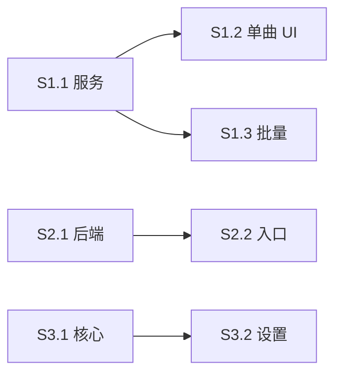

# 开发计划：封面匹配 / 拼音搜索 / 应用内快捷键

**文档版本**: v1.1（审核修订）  
**日期**: 2026-09-16  
**项目版本**: 1.2.3  
**需求依据**: [需求冻结.md](./需求冻结.md) v1.1  
**Story 清单**: [stories/](./stories/)  

**预计工期**: 约 9～13 人日（含封面图源补全、拼音回填、快捷键音量 handler）

---

## 1. 目标与原则

### 目标

1. 在线匹配封面并按改 Tag 规则落盘  
2. 拼音 / 声母搜本地库（顶栏搜索）  
3. 不影响其他 App 的应用内快捷键  

### 原则

- 对齐歌词匹配的**入口与阈值**；单曲右键/全屏均走候选弹窗。  
- 写 Tag 对齐 `metadataEditor` + `/\.mp3$/i`。  
- 不做公证 / 全局快捷键。  
- **每完成一个 Story**：`npm run build` + 更新 `CHANGELOG` `[1.2.3]` + 勾选 TODO；用户要求时再 commit。  

---

## 2. Epic 与阶段

```
Phase A (P0)          Phase B (P0)         Phase C (P1)
Epic 1 封面匹配  ──►  Epic 2 拼音搜索  ──►  Epic 3 应用内快捷键
S1.1 → S1.2 → S1.3    S2.1 → S2.2           S3.1 → S3.2
```

| 阶段 | Epic | Stories | 预估 |
|------|------|---------|------|
| A | 匹配封面 | S1.1 → S1.2 → S1.3 | 4.5～6.5 天 |
| B | 拼音搜索 | S2.1 → S2.2 | 2.5～3.5 天 |
| C | 应用内快捷键 | S3.1 → S3.2 | 1.5～2.5 天 |

S1.2 与 S1.3 可并行；Epic 2/3 不依赖 Epic 1。

---

## 3. Story 总表

| ID | 标题 | 优先级 | 依赖 | 产出要点 |
|----|------|--------|------|----------|
| [S1.1](./stories/S1.1-封面匹配服务与写入.md) | 封面匹配服务与写入链路 | P0 | — | 图源解析+详情补图、有效封面判定、缓存、写 MP3/库 |
| [S1.2](./stories/S1.2-单曲匹配封面UI.md) | 单曲匹配封面 UI | P0 | S1.1 | 右键/全屏候选弹窗；对齐歌词 |
| [S1.3](./stories/S1.3-批量匹配封面.md) | 批量匹配封面（仅无有效封面） | P0 | S1.1 | 工具栏、进度、汇总区分写文件/仅库、与歌词互斥 |
| [S2.1](./stories/S2.1-拼音声母搜索后端.md) | 拼音/声母搜索后端 | P0 | — | 方案锁定+FTS 分流合并 |
| [S2.2](./stories/S2.2-搜索入口接入.md) | 顶栏搜索接入 | P0 | S2.1 | 以顶栏/SearchView 为主 |
| [S3.1](./stories/S3.1-应用内快捷键核心.md) | 应用内快捷键核心 | P1 | — | Space 等；补音量 handler；主窗+迷你 |
| [S3.2](./stories/S3.2-快捷键设置与文案.md) | 快捷键设置与文案 | P1 | S3.1 | 设置页；隐藏未实现项 |

---

## 4. 依赖关系



---

## 5. 技术锚点

| 能力 | 参考路径 |
|------|----------|
| 歌词搜索/阈值/批量 | `src/main/services/lyricsMatchService.ts`（**无 picUrl，勿盲复用映射**） |
| 封面落盘 | `fileScanner.extractCover` → `userData/covers/` |
| MP3 写封面 | `metadataEditor.updateMetadata` |
| MP3 判定 | `/\.mp3$/i.test(filePath)`（`NewTagInfoModal`） |
| 歌词选曲弹窗 | `LyricsMatchSelectModal.vue` |
| 批量进度 | `stores/lyricsMatch.ts` |
| 右键 / 全屏入口 | `SongList.vue` / `NowPlayingView.vue` |
| 本地工具栏 | `LocalMusicList.vue` |
| 搜索 | `MusicDatabase.searchMusic`；顶栏 `AppHeader` → `SearchView` |
| 快捷键（保持全局关） | `shortcutManager.ts`；动作处理 `App.vue`（须补 volume-*） |

---

## 6. 测试计划（总览）

### 封面

- [ ] 搜索无 picUrl 时详情补图成功 / 仍无图时失败原因明确  
- [ ] 无有效封面 MP3：单曲自动匹配 → 外部工具或 `music-metadata` 可读到 APIC；DB 与磁盘缓存一致  
- [ ] `coverPath` 失效（文件缺失）视为无封面，可进批量  
- [ ] 有有效封面：批量跳过；重新匹配需确认  
- [ ] 非 MP3：库更新、文件未改；汇总标明「仅库」  
- [ ] 超大图 / 超时 / 非图片 URL 失败且不写坏文件  
- [ ] 重新匹配后列表/播放栏不再显示旧缓存  
- [ ] 与批量歌词互斥  
- [ ] 写 ID3 失败时 DB 未错误更新  

### 拼音

- [ ] `周杰伦` / `zhoujielun` / `zjl`；顶栏可搜  
- [ ] 含 FTS 特殊字符的 query 不抛错  
- [ ] 万级库可接受延迟  

### 快捷键

- [ ] 主窗 Space 播停；音量加减生效  
- [ ] 迷你播控  
- [ ] 其他 App 不受影响  
- [ ] 搜索框内 Space/字母不误触  

### 回归

- [ ] `npm run build`  
- [ ] 批量歌词、改 Tag、桌面歌词  

---

## 7. 风险

| 风险 | 缓解 |
|------|------|
| 镜像 API 无封面字段 | S1.1 强制详情补图；失败可区分 |
| 原图过大 | 下载大小上限 + 超时，超限失败 |
| 拼音回填久 | S2.1 先锁定方案；A 方案单独估回填 |
| 媒体键不可用 | 默认用 Space/组合键，不依赖 Media* |
| 误开 globalShortcut | 评审检查开关为 false |

---

## 8. 文档与收尾

1. **每个 Story 完成**：`CHANGELOG.md` → `## [1.2.3]`；`TODO.md` 勾选  
2. Epic 或版本收尾：`README.md` 使用说明  
3. 仅用户要求时 git commit  

---

## 9. 变更记录

| 日期 | 说明 |
|------|------|
| 2026-09-16 | v1.0 初版 |
| 2026-09-16 | v1.1 对齐需求冻结审核修订；补测试与风险 |
